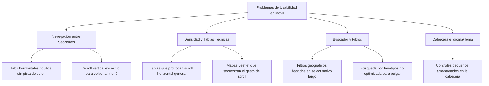
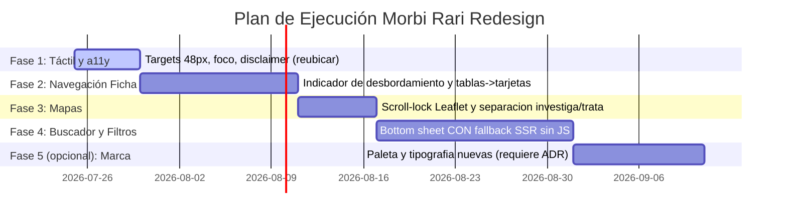

# Propuesta de Rediseño UX/UI: Morbi Rari (Mobile-First)

Esta propuesta técnica de diseño de producto y experiencia de usuario (UX) para **Morbi Rari** se enfoca en resolver las limitaciones de usabilidad actuales en dispositivos móviles y modernizar la interfaz visual, respetando estrictamente las restricciones técnicas, éticas y regulatorias del proyecto.

> **Nota de revisión (2026-07-22).** El diagnóstico de la sección 1 se ha contrastado
> con el código actual y es correcto. Tras esa revisión, la propuesta se separa en **dos
> líneas de trabajo independientes** que no deben confundirse:
>
> - **Usabilidad** (alto impacto, bajo riesgo): indicador de desbordamiento en las
>   pestañas, tablas→tarjetas, *scroll-lock* del mapa, objetivos táctiles de 48 px,
>   *bottom sheets* con fallback sin JS. Es lo que mejora la experiencia sin comprometer
>   nada.
> - **Rediseño visual** (cambio de marca): sustituir la paleta y la tipografía es una
>   **decisión de identidad**, no un ajuste de accesibilidad. Se aísla en la sección 4 y
>   en la Fase 5, y debería discutirse por separado (idealmente con su propio ADR) antes
>   de ejecutarse. Se puede ganar el grueso de la usabilidad **sin** tocar la marca.

---

## 1. Diagnóstico de Usabilidad de la Web Actual (Mobile)

Tras analizar la estructura y la base de código actual (`apps/web`), se identifican los siguientes problemas críticos de usabilidad en dispositivos móviles:



### A. Ficha de Enfermedad (Secciones y Navegación)
*   **Descubribilidad de pestañas (Tabs)**: En pantallas inferiores a `940px`, la navegación de la ficha (`.section-nav`) pasa a una tira horizontal con `overflow-x: auto`. El usuario no tiene ningún indicio visual (como un degradado en el borde derecho o flechas) de que hay más de 3 pestañas disponibles. Secciones cruciales como "Fármacos" o "Dónde acudir" quedan ocultas a menos que el usuario intente arrastrar la barra por casualidad.
*   **Fatiga de scroll para cambio de sección**: Una vez dentro de una sección densa (por ejemplo, "Signos clínicos", con decenas de términos), la barra de navegación queda lejos arriba. Aunque es pegajosa (`sticky`), consume un espacio vertical valioso en móvil en combinación con el encabezado de la página, reduciendo la ventana útil de lectura.

### B. Densidad de Información y Tablas Técnicas
*   **Tablas desbordadas**: Los datos de prevalencia geográfica (`prevalence-map` e `interactive-map`) e información de genes contienen tablas técnicas con múltiples columnas. En móviles con pantallas estrechas (p. ej. 360px), estas tablas se recortan o fuerzan un scroll horizontal global de la página, rompiendo la rejilla.
*   **Secuestro de scroll (Scroll Hijacking)**: Los mapas interactivos (Leaflet) para centros de ensayo o prevalencia geográfica capturan el gesto de arrastre del pulgar. Cuando un usuario intenta hacer scroll vertical en la página y pone el dedo sobre el mapa, el mapa hace zoom o se desplaza internamente, dejando al usuario "atrapado" sin poder continuar bajando en la página.

### C. Búsqueda y Filtros
*   **Falta de optimización para el pulgar**: El formulario de búsqueda actual es un `<input>` y un `<button>` en línea. No cuenta con accesos rápidos ni filtros interactivos a nivel de pantalla principal que se puedan operar cómodamente con el pulgar.
*   **Filtro geográfico rígido**: El filtro actual de ensayos clínicos en `trial-list.tsx` utiliza un `<select>` nativo con múltiples `<optgroup>` y `<option>`. En móvil, abrir un select con decenas de países despliega la interfaz nativa del sistema operativo, que resulta tosca para búsquedas rápidas o selecciones múltiples.

### D. Elementos Globales (Idioma y Tema)
*   **Objetivos táctiles pequeños**: Los conmutadores de idioma (`LangSwitch`) y tema (`ThemeToggle`) en la cabecera son enlaces de texto pequeños amontonados (`EN | ES` al lado del icono de sol/luna). Sus áreas táctiles efectivas están por debajo de los **48x48px** recomendados por las pautas de accesibilidad WCAG 2.2, lo que provoca errores de pulsación frecuente en movilidad.

---

## 2. Principios de Diseño Propuestos

Para orientar el rediseño, se definen cinco principios fundamentales:

1.  **Zona del Pulgar como Prioridad (Thumb-Zone First)**: Todos los elementos interactivos primarios (buscador, activación de filtros, cambio de idioma y navegación de pestañas) se ubican o despliegan en la mitad inferior de la pantalla móvil, facilitando el uso a una sola mano.
2.  **Transparencia de Datos y Contexto (Visible Provenance)**: La fecha de recuperación y la procedencia de la información no son "pie de página de relleno"; son elementos de la interfaz de primer nivel que aportan confianza científica y clínica.
3.  **Degradación Selectiva sin JavaScript**: El diseño visual del sitio se construye asumiendo que el Javascript puede fallar o estar desactivado. Si no hay JS, el layout se degrada a una página continua estructurada de arriba a abajo, 100% legible y con enlaces de ancla funcionales.
4.  **Rigurosidad Semántica Inalterable**: La estética visual nunca simplificará conceptos médicos diferentes. Una designación huérfana no se pintará igual que una aprobación de fármaco; los genes causativos y modificadores tendrán contenedores visualmente diferenciados.
5.  **Accesibilidad sin Concesiones (A11y por Defecto)**: Contraste de color superior a **4.5:1 (AA)** en todo el texto, objetivos táctiles mínimos de **48x48px** con espaciado de **8px**, e indicaciones de foco de teclado altamente contrastadas.

---

## 3. Wireframes Descriptivos (Móvil y Escalabilidad a Escritorio)

### A. Home y Búsqueda (Móvil)

```
+-------------------------------------------------+
| [Logo: Morbi Rari]               [ES/EN] [Luna] |  <- Header accesible (>48px)
+-------------------------------------------------+
|                                                 |
|  ¿Qué enfermedad buscas?                        |  <- Título descriptivo
|                                                 |
|  +-------------------------------------------+  |
|  |  Buscar por nombre, gen o código...     Q |  |  <- Input alto (56px), bordes redondeados
|  +-------------------------------------------+  |
|                                                 |
|  [!] AVISO IMPORTANTE                           |  <- Disclaimer permanente visible
|  Este sitio es una obra de referencia. No       |
|  diagnostica ni sustituye el consejo médico.    |
|                                                 |
|  Explorar catálogo por:                         |  <- Framing neutral (Filtros de catálogo)
|  +------------------+   +--------------------+  |
|  | (o) Por Signos   |   | [ ] Por Ubicación  |  |  <- Botones táctiles grandes para abrir
|  |     Clínicos     |   |     (Ensayos)      |  |     Bottom Sheets de filtrado
|  +------------------+   +--------------------+  |
|                                                 |
+-------------------------------------------------+
```

#### Descripción y Justificación de Usabilidad:
*   **Buscador Destacado**: El campo de texto tiene una altura de **56px** y una fuente de **16px** (evita el zoom automático del teclado de iOS).
*   **Botones de Filtro en la "Zona de Confort" del Pulgar**: Los botones para abrir los paneles de filtros (Signos Clínicos/Fenotipo e Investigación por Región) se sitúan abajo. 
*   **Disclaimer**: Ubicado directamente debajo de la búsqueda y antes de los filtros para cumplir con la línea roja de visibilidad inmediata. **Nota**: el componente `disclaimer-banner.tsx` ya existe y está montado en `layout.tsx`, la home y la ficha; aquí no se crea de cero, solo se **reubica y reestiliza** para la jerarquía móvil. No contar esto como trabajo nuevo.
*   **Escalabilidad a Escritorio**: En pantallas de escritorio, el disclaimer se traslada a una columna lateral derecha de apoyo. El buscador se expande horizontalmente y los filtros de catálogo se muestran en un panel lateral izquierdo permanente, facilitando la exploración con ratón.

---

### B. Filtros en Panel Desplazable (Bottom Sheet - Móvil)

Cuando el usuario pulsa en **"Por Signos Clínicos"** o **"Por Ubicación"**, se desliza un panel desde la parte inferior (Bottom Sheet) que permite interactuar con los filtros usando solo el pulgar.

> **Aclaración obligatoria (regla 20 — funcionar sin JS).** El *bottom sheet* es, por
> definición, una interacción con JavaScript, así que **no es "sin JS"**. El diseño exige
> un **fallback server-rendered**: sin JS, el mismo filtro se presenta como una página o
> formulario normal (un `<form method="get">` con `<fieldset>` de signos o un `<select>`
> de ubicación que envía y recarga con SSR). El *bottom sheet* es una mejora progresiva
> **encima** de ese formulario, no su sustituto. Como esto toca la búsqueda por fenotipo
> —lo más sensible en lo regulatorio (ADR 0002)—, este fallback debe diseñarse
> explícitamente antes de codificar y probablemente merece su propio ADR.

```
+-------------------------------------------------+
| [ X Cerrar ]  Filtrar Catálogo por Signos       |  <- Cabecera de panel alta (52px)
+-------------------------------------------------+
|  Buscar síntoma (ej. Microcefalia)              |
|  +-------------------------------------------+  |
|  |  Escribe un signo clínico...            Q |  |  <- Input táctil
|  +-------------------------------------------+  |
|                                                 |
|  Signos seleccionados:                          |
|  [x] Microcefalia  (x)      [x] Escoliosis (x)  |  <- Chips con botón de borrado amplio
|                                                 |
|  Resultados del catálogo que coinciden:         |
|  -> Mostrar 12 enfermedades                     |  <- Botón de acción principal al pie
|  *(Orden neutral alfabético)                    |  <- Recordatorio de ordenación neutral
+-------------------------------------------------+
```

#### Cumplimiento de Líneas Rojas:
*   **Sin Scoring**: Al presionar "Mostrar 12 enfermedades", se ejecuta una consulta booleana estricta (AND). Las enfermedades devueltas se muestran en orden puramente alfabético. No hay porcentajes de coincidencia ni puntuaciones de probabilidad diagnóstica para respetar la **ADR 0002**.

---

### C. Resultados de Búsqueda (Móvil)

```
+-------------------------------------------------+
| [Q fibrosis quistika                         X] |  <- Buscador pegajoso superior (tolerancia)
+-------------------------------------------------+
| 2 resultados para "fibrosis quistika"           |  <- Conteo claro
+-------------------------------------------------+
| Fibrosis quística                               |  <- Tarjeta de resultado táctil (>48px)
| ORPHA: 586  |  OMIM: 219700                     |
|                                                 |
| Enfermedad genética caracterizada por una       |
| afectación multisistémica de las glándulas...   |
|                                                 |
| Fuente: Orphanet  |  Recuperado: 2026-06-15     |  <- Procedencia y frescura del dato
+-------------------------------------------------+
| Fibrosis quística tardía                        |  <- Segundo resultado en orden determinista
| ORPHA: 99882  |  OMIM: 219700                   |
|                                                 |
| Variante clínica de aparición tardía...         |
|                                                 |
| Fuente: Orphanet  |  Recuperado: 2026-06-15     |
+-------------------------------------------------+
| [!] Morbi Rari no da consejo médico ni          |  <- Disclaimer en el flujo
|     diagnostica.                                |
+-------------------------------------------------+
```

#### Detalles de Experiencia de Usuario:
*   **Buscador Persistente con Corrección**: La barra superior retiene la búsqueda del usuario y permite limpiar la consulta de un toque (con el botón `X` de 48px). Si hay erratas, Meilisearch las resuelve, pero la interfaz indica que se muestran resultados para la correspondencia correcta de forma transparente.
*   **Tarjetas Independientes y Táctiles**: Cada resultado es una tarjeta (`card`) con un sombreado suave y bordes redondeados de `8px`, donde toda el área de la tarjeta actúa como enlace (`display: block` en el enlace). Esto facilita pulsar sobre ella en pantallas móviles sin requerir puntería fina.
*   **Metadata Técnica Legible**: Se muestran códigos clave (ORPHA, OMIM) en forma de badges visualmente limpios pero de alto contraste, lo que ayuda a médicos y estudiantes a identificar la enfermedad de un vistazo.
*   **Escalabilidad a Escritorio**: En resoluciones de escritorio, los resultados se muestran en una lista centralizada con un panel lateral izquierdo de filtros activos para poder refinar por continente, país de ensayos o tipo de enfermedad de forma ágil.

---

### D. Ficha de Enfermedad (Móvil)

```
+-------------------------------------------------+
| <- Volver al buscador                           |
+-------------------------------------------------+
| SÍNDROME DE MARFAN                              |  <- Título claro y contrastado
| ORPHA: 558  |  Enfermedad rara (Clasificación)  |  <- Metadatos principales
+-------------------------------------------------+
| [!] AVISO: No es consejo médico. No diagnostica |  <- Disclaimer condensado
+-------------------------------------------------+
| [ Definición = ] [ Actividad (3) ] [ Genes (2) ]|  <- Barra de secciones pegajosa
| [ Signos (12) ]  [ Referencias ]   [ Fuentes ]  |  <- Fading en los bordes si desborda
+-------------------------------------------------+
| SECCIÓN: DEFINICIÓN Y DATOS CLAVE               |
|                                                 |
| El síndrome de Marfan es un trastorno del...    |
|                                                 |
| Datos Clave:                                    |
| +---------------------------------------------+ |
| | Herencia: Autosómica Dominante              | |  <- Tarjetas de información en lugar
| | Edad de inicio: Infancia, Neonatal          | |     de tablas densas
| | Prevalencia: 1-5 / 10 000                   | |
| +---------------------------------------------+ |
|                                                 |
| Fuente: Orphanet  |  Recuperado: 2026-06-15     |  <- Fecha de recuperación visible
+-------------------------------------------------+
```

#### Estructura y Navegación Móvil:
*   **Menú de Secciones en Rejilla Fija o Carrusel con Pistas Visuales**: En lugar de pestañas horizontales infinitas que ocultan contenido, proponemos un **menú de navegación de cuadrícula colapsable** o un carrusel que añade un degradado sutil (`linear-gradient(to right, transparent, var(--bg))`) en el borde derecho para indicar visualmente que hay más secciones disponibles al arrastrar.
*   **Conversión de Tablas a Tarjetas (Cards)**: En pantallas móviles, las tablas técnicas se transforman mediante CSS Media Queries (`display: block` en los elementos de tabla) a tarjetas verticales independientes. Cada fila de la tabla se convierte en un bloque con etiquetas en negrita a la izquierda y valores a la derecha. Esto evita por completo el desbordamiento horizontal y mejora la legibilidad.
*   **Control del Mapa (Scroll Lock)**: Los mapas interactivos de prevalencia y ensayos no se activan para gestos táctiles de scroll por defecto. El usuario debe pulsar un botón explícito de **"Activar mapa interactivo"** para poder moverlo; de esta forma, deslizar el pulgar por encima de la zona del mapa simplemente desplaza la página de manera natural sin secuestrar el scroll.
*   **Comportamiento Sin JavaScript (SSR)**: Si el cliente no tiene JavaScript activo, la barra de pestañas superior se oculta automáticamente vía CSS y la página se muestra como un único documento continuo. El usuario simplemente hace scroll vertical clásico para leer toda la ficha. Todos los buscadores de Internet (SEO) rastrean el 100% de la ficha sin problemas.

---

## 4. Propuesta de Sistema Visual *(cambio de marca — decisión aparte)*

> **Advertencia de alcance.** Esta sección es un **rediseño de identidad**, no una mejora
> de usabilidad, y su esfuerzo **no es bajo**: reescribir los tokens y cambiar la fuente
> toca todo `globals.css` y obliga a revalidar cada componente en claro y oscuro. La
> paleta actual (`--accent: #1a5f7a`, azul) ya está considerada y cumple contraste; pasar
> a *teal* y a **Inter** es una decisión de marca legítima pero opcional. Recomendación:
> tratarla como propuesta separada (Fase 5, y a poder ser un ADR), no mezclarla con las
> fases de usabilidad. Nota: **Inter es probablemente la fuente "moderna" más genérica**,
> así que el argumento de "alejarse de lo genérico" no la justifica por sí solo; el stack
> `system-ui` actual no tiene peticiones externas ni coste de *bundle*.

### A. Tipografía y Escala
*   **Familia Tipográfica**: **Inter**, autohospedada con `next/font` (nunca desde el CDN de Google en tiempo de ejecución, para no introducir peticiones a terceros). Se elige por su legibilidad en pantallas pequeñas y su variedad de pesos. **Mantener `system-ui` es una alternativa válida** si se prioriza cero dependencias; la escala tipográfica de abajo aplica con cualquiera de las dos.
*   **Escala Tipográfica (Mobile-first, base 14px en móvil, 16px en escritorio)**:
    *   `h1` (Título de enfermedad): `24px` (móvil) / `32px` (escritorio). Peso: `700` (Bold).
    *   `h2` (Títulos de sección): `18px` (móvil) / `22px` (escritorio). Peso: `600` (Semi-bold).
    *   `h3` (Subsecciones/Tarjetas): `15px` (móvil) / `18px` (escritorio). Peso: `600`.
    *   `body` (Texto de definición/datos): `14px` (móvil) / `16px` (escritorio). Altura de línea: `1.6` (`line-height`).
    *   `small` (Metadatos/Fechas de recuperación): `12px` (móvil) / `13px` (escritorio). Color: `var(--muted)`.

### B. Sistema de Color (Con Relación de Contraste Validada)

Se eligen colores con alta personalidad visual que superan con creces las pautas de accesibilidad **WCAG AA** (>4.5:1 para texto normal, >3:1 para controles y texto grande).

```
+------------------+-----------------------------+-----------------------------+
| Token CSS        | Tema Claro (Light)          | Tema Oscuro (Dark)          |
+------------------+-----------------------------+-----------------------------+
| --bg             | #F8F9FA (Gris neutro suave) | #0B0F19 (Azul noche oscuro) |
| --surface        | #FFFFFF (Blanco puro)       | #161F30 (Azul pizarra)      |
| --text           | #1F2937 (Gris carbón)       | #F3F4F6 (Blanco grisáceo)   |
| --muted          | #4B5563 (Gris medio)        | #9CA3AF (Gris plateado)     |
| --accent         | #0F766E (Verde azulado/Teal)| #2DD4BF (Turquesa brillante)|
| --accent-soft    | #F0FDFA (Teal muy claro)    | #0F2E30 (Teal oscuro/opaco) |
| --warn-bg        | #FFFBEB (Amarillo pálido)   | #1E1B15 (Marrón muy oscuro) |
| --warn-border    | #F59E0B (Ámbar)             | #D97706 (Ámbar oscuro)      |
+------------------+-----------------------------+-----------------------------+
```

#### Comprobación de Contrastes Clave:
*   **Texto normal (`--text`) sobre Superficie (`--surface`)**:
    *   *Claro*: `#1F2937` sobre `#FFFFFF` -> Contraste **15.0:1** (Supera ampliamente el nivel AAA de 7.0:1).
    *   *Oscuro*: `#F3F4F6` sobre `#161F30` -> Contraste **11.4:1** (Supera nivel AAA).
*   **Texto secundario (`--muted`) sobre Superficie**:
    *   *Claro*: `#4B5563` sobre `#FFFFFF` -> Contraste **7.0:1** (Supera nivel AAA).
    *   *Oscuro*: `#9CA3AF` sobre `#161F30` -> Contraste **5.2:1** (Supera nivel AA).
*   **Texto destacado de Enlace/Acción (`--accent`) sobre Superficie**:
    *   *Claro*: `#0F766E` sobre `#FFFFFF` -> Contraste **5.6:1** (Supera nivel AA).
    *   *Oscuro*: `#2DD4BF` sobre `#161F30` -> Contraste **6.5:1** (Supera nivel AA).

### C. Cuadrícula de Espaciado (Spacing)
Uso de un sistema basado en múltiplos de **8px** para mantener la consistencia en el ritmo vertical:
*   `4px`: Margen interno de etiquetas pequeñas (badges).
*   `8px`: Espacio entre elementos relacionados (ej. input y su etiqueta).
*   `16px`: Relleno interno estándar de tarjetas (`cards`), margen entre párrafos.
*   `24px`: Margen entre secciones o bloques principales en móviles.
*   `32px`: Relleno superior/inferior de la página en móviles.

---

## 5. Justificación de Decisiones Bajo Restricciones y Líneas Rojas

En el diseño de Morbi Rari, varias decisiones estéticas comunes en la web moderna se descartan intencionadamente para salvaguardar las líneas rojas:

### 1. Descarte de Pestañas Animadas por Cliente (JS-only)
*   *Estética descartada*: Transiciones horizontales fluidas ("swiping") controladas por librerías JS para pasar de una pestaña a otra de la ficha.
*   *Justificación técnica*: Rompe la indexación SSR y el funcionamiento sin JS. En su lugar, el cambio de sección se gestiona mediante anclajes estándar en la URL (`#seccion`) combinados con atributos de datos CSS (`data-active-section`). Si JS falla o no se carga, el CSS muestra todas las secciones secuencialmente de forma nativa en lugar de dejar la pantalla rota.

### 2. Descarte de Listas de Diagnóstico Predictivas (Smart-matching/Scoring)
*   *Estética descartada*: Una barra que indica el "% de compatibilidad diagnóstica" o una ordenación de resultados según la cantidad de síntomas coincidentes.
*   *Justificación regulatoria (Línea Roja)*: Evita clasificar el software como dispositivo médico regulado (MDSW) bajo la directiva europea MDCG 2019-11. La ordenación de resultados en las búsquedas por síntomas es puramente **alfabética** o por **código ORPHA**. El diseño de la interfaz enfatiza el concepto "Filtrar Catálogo" y prohíbe introducir datos personales del paciente (edad, sexo) para no sugerir un proceso de diagnóstico.

### 3. Separación Visual Estricta de Conceptos Clínicos
*   *Estética descartada*: Agrupar todos los genes asociados a una enfermedad en una única lista simple con etiquetas de colores sutiles.
*   *Justificación médica (Línea Roja)*: Para un genetista o un paciente, un *gen causante* (cuya mutación directa genera el síndrome) y un *gen modificador* (que altera la severidad pero no causa la enfermedad) son conceptos radicalmente diferentes. Mezclarlos visualmente induce a error clínico. La UI presentará secciones diferenciadas e independientes para cada tipo de relación génica.
*   *Designación huérfana vs Aprobación comercial*: La ficha de fármacos incluye un cartel de advertencia de alto contraste (`--warn-border`) que aclara que una designación huérfana por parte de la EMA es un incentivo de investigación y no significa que el medicamento esté aprobado para su compra o uso en pacientes.

### 4. Ausencia de Retratos de Pacientes
*   *Estética descartada*: Cabeceras de enfermedad con fotografías reales de pacientes mostrando rasgos físicos típicos.
*   *Justificación ética y regulatoria (Línea Roja)*: Respeta la dignidad y privacidad de las personas (especialmente menores) y evita el morbo visual. La interfaz utiliza exclusivamente gráficos vectoriales limpios para diagramas de herencia (árboles genealógicos de transmisión autosómica/recesiva) y mapas geográficos de prevalencia.

---

## 6. Plan de Ejecución Priorizado por Fases

Se divide en fases por relación esfuerzo/impacto. Las **Fases 1–4 son usabilidad** (recomendadas, bajo riesgo). La **Fase 5 es el cambio de marca** (opcional, decisión aparte). El orden prioriza lo de mayor impacto y menor riesgo primero; el rebranding va al final justamente porque es el más discutible y el que más superficie toca.



> **Transversal a todas las fases** (reglas 21 y 25): todo texto de interfaz nuevo va a
> `messages/{es,en}.json` (nunca incrustado), y cada fase se cierra con `npm run
> typecheck && npm run build` en `apps/web` antes de darla por hecha.

### Fase 1: Táctil, Foco y Disclaimer (Impacto: Alto | Esfuerzo: Bajo — real)
*   **Acción**: Agrandar los conmutadores de idioma (`LangSwitch`) y tema (`ThemeToggle`) de la cabecera móvil a un mínimo de 48×48 px con 8 px de separación; reforzar el indicador de foco de teclado. **Reubicar y reestilizar** el `disclaimer-banner` existente en la jerarquía móvil (no crearlo: ya está montado).
*   **Por qué**: Resuelve los fallos de pulsación y de accesibilidad física con cambios acotados de CSS, sin tocar la paleta ni la tipografía.

### Fase 2: Reestructuración de la Ficha y Tablas en Móvil (Impacto: Muy Alto | Esfuerzo: Medio)
*   **Acción**:
    1.  Añadir el degradado indicador de desbordamiento (fading) a la tira horizontal de `.section-nav` por debajo de 940 px.
    2.  Aplicar CSS adaptativo a las tablas de genes, referencias cruzadas y prevalencias para que colapsen en tarjetas verticales (`display:block`) en móvil.
    3.  Verificar que **sin JS** la ficha se muestre como documento continuo con anclas funcionales.
*   **Por qué**: Es el mayor problema de usabilidad de la ficha densa; resuelve el desbordamiento horizontal sin perder contenido indexable (SEO).

### Fase 3: Mapas y Separación de Conceptos (Impacto: Medio-Alto | Esfuerzo: Bajo)
*   **Acción**: Botón explícito "Activar mapa interactivo" (scroll-lock) sobre el Leaflet para que el pulgar deje de quedar atrapado; separar visualmente centro que *investiga/ensaya* de centro que *trata* (regla 17).
*   **Por qué**: Elimina el secuestro de scroll —bloqueante en móvil— con poco código, y previene una confusión clínica crítica. Se adelanta a la búsqueda porque es barato y de riesgo casi nulo.

### Fase 4: Buscador Móvil y Filtros por Bottom Sheet (Impacto: Alto | Esfuerzo: Alto — el más sensible)
*   **Acción**: Diseñar **primero el fallback SSR sin JS** (formulario `method="get"` para signos HPO y ubicación de ensayos) y encima el *bottom sheet* como mejora progresiva. Orden de resultados puramente alfabético/por ORPHA, sin scoring, sin datos de paciente (ADR 0002).
*   **Por qué**: Facilita la exploración a una mano, pero toca la búsqueda por fenotipo —lo más delicado en lo regulatorio—; por eso va después de lo seguro y **conviene un ADR previo** que fije el fallback y el encuadre.

### Fase 5 (opcional): Cambio de Marca Visual (Impacto: Medio | Esfuerzo: Alto — decisión aparte)
*   **Acción**: Sustituir la paleta actual por la propuesta (teal) y la fuente por Inter, con revalidación de contraste de **todos** los componentes en claro y oscuro.
*   **Por qué**: Moderniza la identidad, pero **no mejora usabilidad por sí mismo** y toca todo `globals.css`. Debe decidirse por separado (con ADR) y no es requisito para las fases anteriores.
